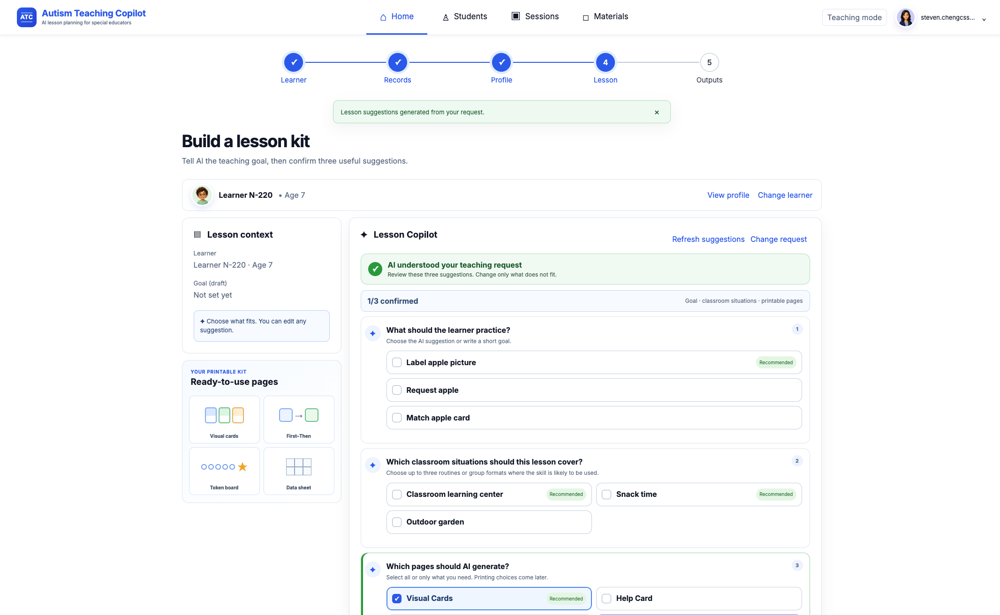
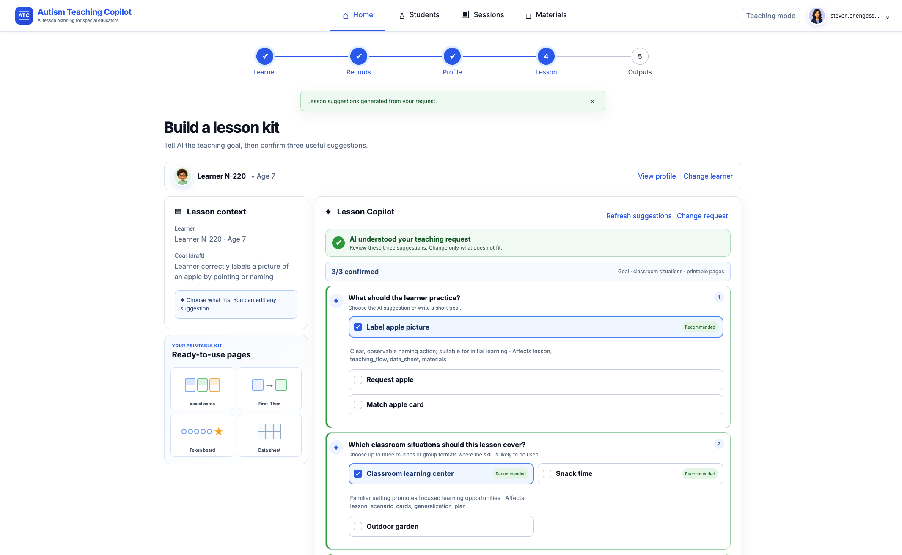

# Autism Teaching Copilot — Frontend

Autism Teaching Copilot gives special educators one continuous workflow for turning reviewed learner information into personalized, classroom-ready teaching support.

Instead of asking a teacher to start from a blank lesson template, the product connects the work that already happens across the day:

**Learner records → teacher-reviewed profile → AI-assisted lesson interpretation → teacher selections → printable lesson kit → classroom observations → progress and next-session planning**

The teacher remains the decision maker at every stage. AI proposes structured options, while the teacher confirms the learning goal, classroom situations, communication modes, materials, edits, approvals, and recorded outcomes.

## What the product demonstrates

- **Personalized preparation:** reviewed communication, access, prompting, interests, and safety constraints remain traceable into the lesson package.
- **Teacher-controlled AI:** teachers select, reject, or edit AI suggestions before anything becomes part of the lesson.
- **Classroom-ready output:** approved materials can be assembled into named printable PDF sets for teaching, desk use, data collection, and closeout.
- **Faster classroom recording:** structured session observations can be saved and resumed without inventing learner responses.
- **Evidence-informed iteration:** completed observations support cautious progress summaries and teacher-approved next-session changes without making clinical or causal claims.
- **Privacy-conscious presentation:** learner codes are used in printable and demonstration views instead of direct learner names.

## Product preview

### Review AI suggestions while preserving teacher choice



### Confirm only the goal, classroom situations, and pages that fit



The selected presentation assets and usage notes are in [docs/marketing-screenshots](docs/marketing-screenshots/README.md).

## Run the frontend locally

```bash
npm install
cp .env.example .env
npm run dev
```

The browser uses `VITE_API_BASE` to reach Backend v2. AI provider credentials, database credentials, storage credentials, and other secrets must remain in the backend environment and must never be placed in frontend files.

## Quality checks

```bash
npm test
npm run build
```

The production build uses Cognito authentication and the configured HTTPS API. Local development may use the repository's explicitly enabled synthetic/demo mode; synthetic reset and fixture routes must remain unavailable in production.
